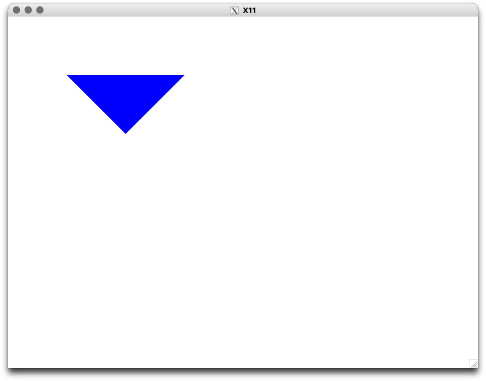

#### WRAPPER FOR X11
- so its easier to use lol
- real engine is under 
- (2d): https://github.com/felixjaschul/gameengineX11
- (3d): https://github.com/felixjaschul/rasterizerengineX11

#### THIS IS IT:

#### TL:DR
- obv only runs on LINUX (tested) or WSL (tested) and on MACOS (my setup) if XQuartz is installed (because X11 ??)
- the performance has nothing to do with the software but how trash your cpu is bla bla.
- bla bla. Windows wont be supported bla bla.
